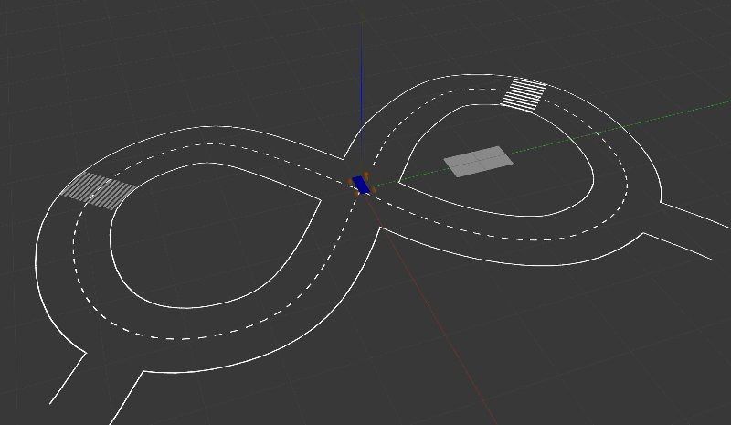

# robocar_v2

Self driving robo car. Target functionality:

* lane following (in progress)

* obstacles avoiding (in progress)

* road signs recognition (planned)

## Architecture (in progress)

## How to build 

Be creative in case of problems.

Install ROS melodic: [Ubuntu install of ROS Melodic](http://wiki.ros.org/melodic/Installation/Ubuntu) 

Activate standard environment: 

    source /opt/ros/melodic/setup.bash

Clone the repo

    git clone --recurse-submodules git@github.com:serge-m/robocar_v2.git ~/robocar_v2
    

Then run

    rosdep update
    cd ~/robocar_v2/catkin_ws
    rosdep install --from-paths src --ignore-src --rosdistro=melodic -y

To build all the nodes: 

    cd ~/robocar_v2/catkin_ws
    catkin_make  install

## How to run 

Note: the project is under development. Things may not work. Be creative.

### Simulation

    # launch the simulation
    roslaunch robocar_main robocar.launch world_name:=$(rospack find robocar_world)/worlds/road.world simulation:=1    

### Dependencies

* For mouse_odometry: add currect user to `input` group: `sudo adduser $USER input`, reboot to enable changes
* ...

