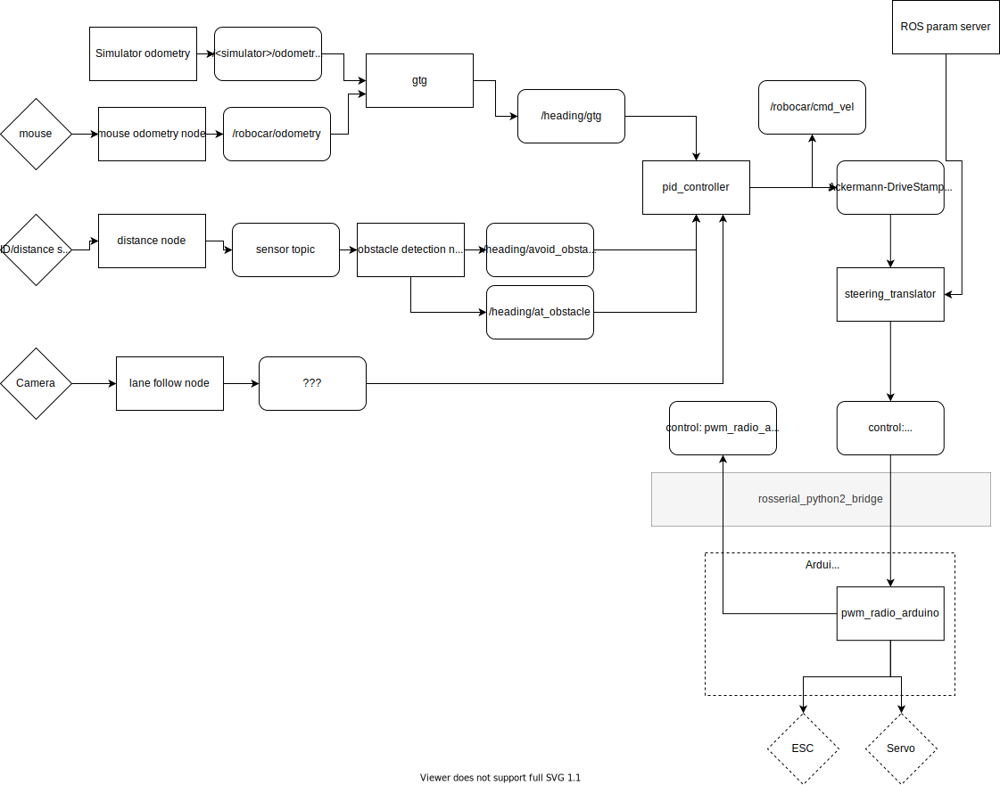
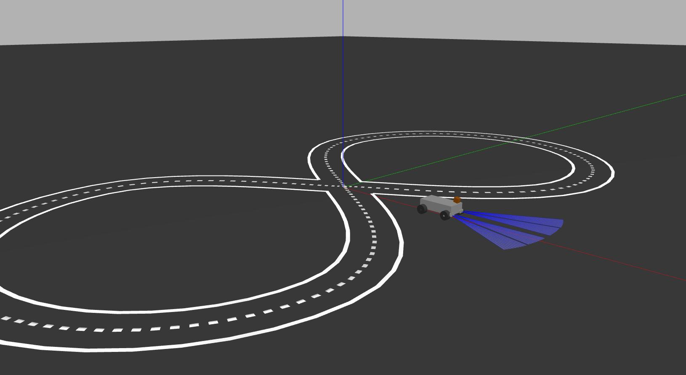
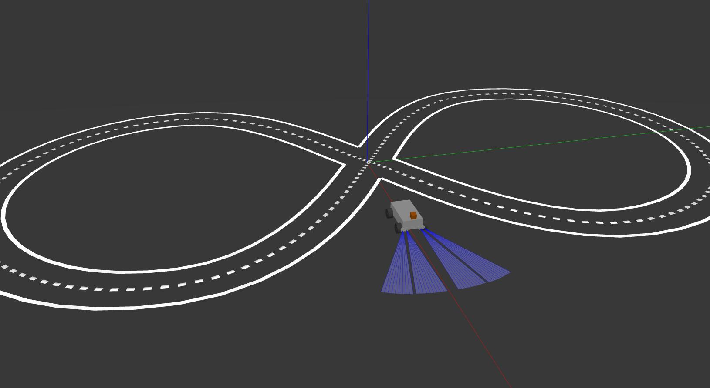

# robocar_v2

Self driving robo car. Target functionality:

* lane following (in progress)

* obstacles avoiding (in progress)

* road signs recognition (planned)

## Architecture (in progress)

## How to build 

Be creative in case of problems.

Install ROS melodic: [Ubuntu install of ROS Melodic](http://wiki.ros.org/melodic/Installation/Ubuntu) 

Activate standard environment: 

    source /opt/ros/melodic/setup.bash

Clone the repo

    git clone --recurse-submodules git@github.com:serge-m/robocar_v2.git ~/robocar_v2
    

`raspicam` node is built for raspberry only. It won't work for a PC.
If building on Raspberry Pi, install dependencies for raspicam node (as described in raspicam's README):

create a file `/etc/ros/rosdep/sources.list.d/30-ubiquity.list` and add to it:

    yaml https://raw.githubusercontent.com/UbiquityRobotics/rosdep/master/raspberry-pi.yaml

Then run

    rosdep update
    cd ~/robocar_v2/catkin_ws
    rosdep install --from-paths src --ignore-src --rosdistro=melodic -y

Preparation for raspicam node done.

To build all the nodes one has to run `catkin_make install` inside `catkin_ws` directory. 
On the Raspberry the simulator may not be installed therefore we have to exclude `robocar_description` from the build:

    cd ~/robocar_v2/catkin_ws
    catkin_make -DCATKIN_BLACKLIST_PACKAGES="robocar_description" install

## How to run 

Note: the project is under development. Things may not work. Be creative.

### Simulation

    # launch the simulation
    roslaunch robocar_simulation robocar_sim.launch model:=$(rospack find robocar_ackermann_description)/urdf/car.xacro joint_params:=$(rospack find robocar_simulation)/config/em_3905_joint_ctrlr_params.yaml world_name:=$(rospack find robocar_world)/worlds/road.world

    # launch rqt_publisher, then put some messages to the ackermann_cmd topic
    rosrun rqt_publisher rqt_publisher &
    

### Dependencies

* For mouse_odometry: add currect user to `input` group: `sudo adduser $USER input`, reboot to enable changes
* ...

### Running camera node and viewer

    roslaunch raspicam_node camerav2_410x308_30fps.launch &
    rosrun rqt_image_view rqt_image_view

Manually loading camera settings:

    rosrun dynamic_reconfigure dynparam load /raspicam_node ./camera_settings.yaml

rosbag recordings:

    rosbag record --split --duration=60s -o odom_recording_ --all
